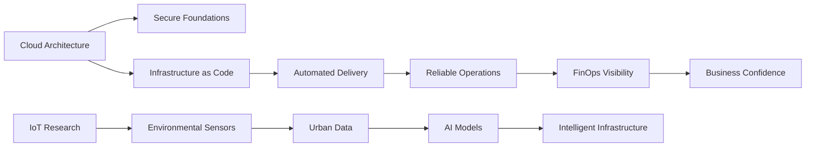
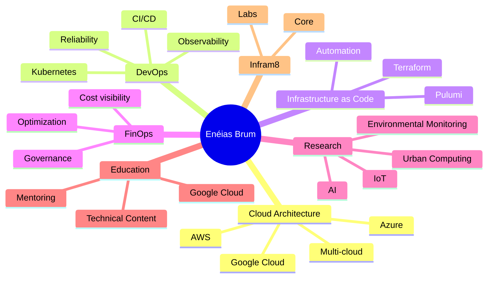

# Hi, I'm Enéias Brum ``

### Senior Cloud Engineer · Solutions Architect · Google Cloud Instructor · Founder of Infram8

I work at the intersection of **cloud architecture**, **DevOps**, **Infrastructure as Code (IaC)**, **FinOps (Cloud Financial Operations)**, **Kubernetes**, **technical governance**, and **intelligent infrastructure systems**.

```

```

My professional focus is helping companies build reliable, secure, automated, and cost-aware technical foundations, especially across **AWS (Amazon Web Services)**, **Google Cloud Platform (GCP)**, and modern cloud-native environments.

I am also pursuing a **Master’s degree in Urban Infrastructure Systems**, researching low-cost environmental sensing, Internet of Things (IoT), and Artificial Intelligence (AI) applied to smarter and healthier cities.

---

## Current Focus

- Building and advising on **modern cloud architectures** for startups and growing companies.
- Developing **Infram8**, a premium infrastructure company focused on cloud architecture, security, FinOps, automation, and technical governance.
- Teaching and sharing knowledge as a **Google Cloud Instructor**.
- Researching **IoT (Internet of Things), AI (Artificial Intelligence), environmental monitoring, and urban computing**.
- Designing practical systems that connect cloud engineering, data, automation, and real-world infrastructure.

---

## Authority Snapshot

| Area                   | Focus                                                                                            |
| ---------------------- | ------------------------------------------------------------------------------------------------ |
| Cloud Architecture     | AWS (Amazon Web Services), Google Cloud Platform (GCP), Azure, multi-cloud foundations           |
| DevOps & SRE           | Kubernetes, CI/CD (Continuous Integration and Continuous Delivery), observability, reliability   |
| Infrastructure as Code | Terraform, Pulumi, automation patterns, reusable cloud foundations                               |
| FinOps                 | Cost visibility, cloud financial governance, startup cloud efficiency                            |
| Security               | Cloud security baseline, identity, access control, infrastructure hardening                      |
| Education              | Google Cloud instruction, technical mentoring, professional knowledge sharing                    |
| Research               | IoT (Internet of Things), AI (Artificial Intelligence), smart cities, environmental intelligence |

---

## What I Build



---

## Infram8

I am building **Infram8**, a founder-led modern infrastructure company focused on helping early-stage and growing companies create strong technical foundations without unnecessary complexity.

**Infram8 Core**

- Cloud architecture
- DevOps
- Infrastructure as Code (IaC)
- FinOps (Cloud Financial Operations)
- Security baseline
- Reliability and observability
- Technical governance

**Infram8 Labs**

- Artificial Intelligence (AI)
- Internet of Things (IoT)
- Urban computing
- Environmental intelligence
- Smart infrastructure research

> Strong infrastructure is not just about tools. It is about clarity, reliability, security, cost awareness, and the ability to grow without losing control.

---

## Technologies & Tools

### Cloud & Platform Engineering

<p align="left">
  
  
  
  
  
  
</p>

### Infrastructure as Code & Automation

<p align="left">
  
  
  
  
</p>

### Programming & Scripting

<p align="left">
  
  
  
  
  
  
</p>

### Data, Backend & Research

<p align="left">
  
  
  
  
  
</p>

---

## Certifications & Professional Direction

I hold professional certifications across cloud, Kubernetes, and DevOps, including:

- AWS Certified Solutions Architect Professional
- AWS Certified DevOps Engineer Professional
- Google Cloud Professional Cloud Architect
- Certified Kubernetes Administrator (CKA)
- Certified Kubernetes Application Developer (CKAD)
- Kubernetes and Cloud Native Associate (KCNA)

My current professional direction is focused on:

- Multi-cloud architecture
- Cloud security
- FinOps (Cloud Financial Operations)
- AI (Artificial Intelligence) infrastructure
- Kubernetes platforms
- Infrastructure automation
- Technical leadership and education

---

## GitHub Activity

<p align="center">
  
</p>

<p align="center">
  
</p>

<p align="center">
  
</p>

<p align="center">
  
</p>

---

## Profile Highlights

<p align="center">
  
</p>

---

## Featured Themes



---

## Connect with Me

<p align="left">
  <a href="https://www.linkedin.com/in/eneiasbrumjr" target="_blank">
    
  </a>
  <a href="https://www.github.com/eneiasbrumjr" target="_blank">
    
  </a>
  <a href="https://www.x.com/BrumEneiasJr" target="_blank">
    
  </a>
</p>

---

## Personal Note

I believe strong engineering is not only about building systems that work. It is about building systems that are clear, secure, reliable, explainable, and useful for the people and organizations that depend on them.

That is the kind of infrastructure I like to design, teach, and improve.
