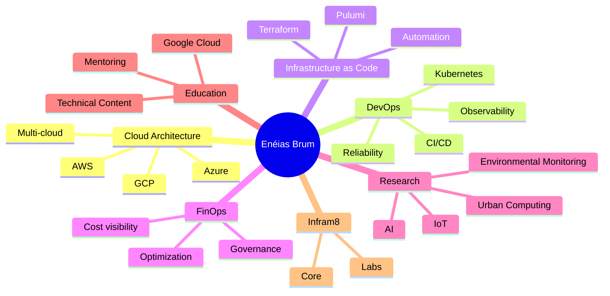

# Hi, I'm Enéias Brum 👋

### Computer Engineer · Senior Cloud Engineer · Solutions Architect · Google Cloud Instructor · Founder of [Infram8](https://infram8.com)

I am a **Computer Engineer** working at the intersection of **Cloud Architecture**, **DevOps**, **Infrastructure as Code (IaC)**, **Kubernetes**, **Cloud Security**, **FinOps (Cloud Financial Operations)**, **technical governance**, and **intelligent infrastructure systems**.

My focus is helping organizations build reliable, secure, automated, and cost-aware technical foundations across **Amazon Web Services (AWS)**, **Google Cloud Platform (GCP)**, **Microsoft Azure**, and modern cloud-native environments.

I am also pursuing a **Master’s degree in Urban Infrastructure Systems**, researching **Internet of Things (IoT)**, **Artificial Intelligence (AI)**, low-cost environmental sensing, and intelligent systems for smarter and healthier cities.

---

## About Me

- ☁️ **Multi-cloud architect** with strong experience in AWS, GCP, Azure, Kubernetes, automation, and infrastructure modernization.
- 🧠 **Computer Engineer** with a practical and strategic approach to cloud, infrastructure, and systems design.
- 🏗️ **Founder of [Infram8](https://infram8.com)**, a premium infrastructure company focused on cloud architecture, security, FinOps, automation, and technical governance.
- 🎓 **Google Cloud Instructor**, helping professionals and teams build practical cloud capability.
- 🔬 **Researcher in IoT and AI**, connecting cloud engineering with urban computing, environmental intelligence, and real-world infrastructure challenges.
- 🌍 Fluent in **English, Spanish, French, and Portuguese**, with continuous interest in global collaboration and knowledge sharing.

---

## Current Focus

- Designing and advising on **modern cloud architectures** for startups and growing companies.
- Building **secure, scalable, and cost-aware foundations** with Infrastructure as Code (IaC), observability, and governance.
- Growing **[Infram8](https://infram8.com)** across two fronts:
  - **Infram8 Core**: cloud architecture, DevOps, security, FinOps, reliability, observability, and governance.
  - **Infram8 Labs**: AI, IoT, environmental intelligence, urban computing, and intelligent infrastructure systems.
- Teaching and sharing knowledge as a **Google Cloud Instructor**.
- Advancing research in **low-cost sensor networks**, **environmental monitoring**, and **AI-based predictive systems**.

---

## Authority Snapshot

| Area | Focus |
|---|---|
| Cloud Architecture | AWS, GCP, Azure, multi-cloud foundations |
| DevOps & Platform Engineering | Kubernetes, CI/CD, automation, developer platforms |
| Infrastructure as Code (IaC) | Terraform, Pulumi, reusable infrastructure patterns |
| Reliability & Operations | Observability, resilience, operational maturity |
| Security & Governance | Cloud security baseline, access control, technical governance |
| FinOps | Cost visibility, cloud efficiency, financial accountability |
| Education | Google Cloud instruction, mentoring, technical communication |
| Research | IoT, AI, environmental monitoring, urban computing |

---

## Featured Domains

---

## Tech Stack

### Cloud & Platform

  
  
  
  
  
  

### Infrastructure as Code, CI/CD & Automation

  
  
  
  
  

### Programming, Backend & Data

  
  
  
  
  
  
  
  
  
  

### Research & Intelligent Infrastructure

  
  
  
  

---

## Certifications

- **AWS Certified Solutions Architect – Professional**
- **AWS Certified DevOps Engineer – Professional**
- **Google Cloud Professional Cloud Architect**
- **Google Cloud Authorized Instructor**
- **Certified Kubernetes Administrator (CKA)**
- **Certified Kubernetes Application Developer (CKAD)**
- **Kubernetes and Cloud Native Associate (KCNA)**

---

## GitHub Activity

  

  

  

  

  

  

---

## Highlighted Repositories

> Replace the repository names below with the ones you most want to promote.

- [`2025-52-projects`](https://github.com/eneiasbrumjr) - Cloud, Kubernetes, automation, and platform engineering projects.
- [`Infram8`](https://infram8.com) - Founder-led infrastructure positioning, services, and technical direction.
- [`IoT / Research Work`](https://github.com/eneiasbrumjr) - Applied work involving sensors, environmental intelligence, and AI.

---

## Connect With Me

  
  
  
  
  

---

## Final Note

I believe strong engineering is not just about deploying infrastructure. It is about creating **clarity, security, reliability, automation, and sustainable growth**.

That is the type of work I aim to build, teach, and scale through engineering, research, and [Infram8](https://infram8.com).
